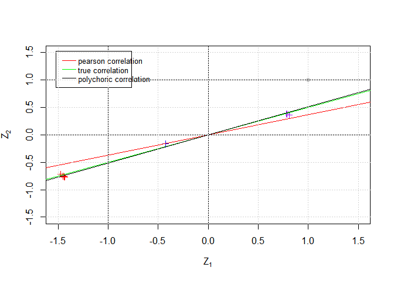

# IRLSpoly

The traditional algorithms for estimating the polyserial/polychoric
correlation coefficients are designed based on the maximum likelihood
method. Although they are accurate, they are very slow due to the
numerical calculation of double integral in iteration.

IRLS provides an iterative regression algorithm based on conditional
mathematical expectation, which can calculate the polyserial/polychoric
correlation coefficient extremely quickly with similar accuracy.

The paper explaining the theory is placed in .

## Installation

You can install the development version of IRLSpoly from
[GitHub](https://github.com/) with:

``` r
# install.packages("devtools")
devtools::install_github("encoreus/IRLSpoly")
```

``` r
options (warn = -1)
library(IRLSpoly)
library(psych)
```

## Simmulation

You can use gen_polyserial and gen_polychoric to generate simulated
polyserial/polychoric sequences:

``` r
set.seed(1997)
X1 = gen_polyseries(500,0.5,-1:1)
X2 = gen_polychoric(500,0.5,-1:0,0:1)
X1[,1:6]
#>            [,1]      [,2]      [,3]    [,4]      [,5]       [,6]
#> [1,] -0.7675075 -1.106608 -1.737503 1.25975 -1.446003 -0.2172377
#> [2,]  3.0000000  2.000000  2.000000 4.00000  1.000000  2.0000000
X2[,1:6]
#>      [,1] [,2] [,3] [,4] [,5] [,6]
#> [1,]    3    2    1    3    3    3
#> [2,]    2    2    1    2    3    2
table(X2[1,],X2[2,])
#>    
#>      1  2  3
#>   1 71 15  1
#>   2 94 54 18
#>   3 84 97 66
```

You can use esti_polyserial and esti_polychoric to estimate
polyserial/polychoric coefficients:

``` r
result1 = esti_polyserial(X1)
result2 = esti_polychoric(X2)

print("The rhohat of polyserial coefficient is:")
#> [1] "The rhohat of polyserial coefficient is:"
print(result1$rho)
#> [1] 0.4854298
print("The standard error of polyserial coefficient is:")
#> [1] "The standard error of polyserial coefficient is:"
print(result1$std)
#> [1] 0.0427539

print("The rhohat of polyserial coefficient is:")
#> [1] "The rhohat of polyserial coefficient is:"
print(result2$rho)
#> [1] 0.5131697
print("The standard error of polyserial coefficient is:")
#> [1] "The standard error of polyserial coefficient is:"
print(result2$std)
#> [1] 0.0343688
```

Compare with the MLE in package: polycor:

``` r
MLE1 = polycor::polyserial(X1[1,],X1[2,],ML=T,std.err=T)
MLE2 = polycor::polychor(X2[1,],X2[2,],ML=T,std.err=T)

print("The rhohat of polyserial coefficient is:")
#> [1] "The rhohat of polyserial coefficient is:"
print(MLE1$rho)
#>           
#> 0.4896122
print("The standard error of polyserial coefficient is:")
#> [1] "The standard error of polyserial coefficient is:"
print(sqrt(MLE1$var[1,1]))
#> [1] 0.03501101

print("The rhohat of polyserial coefficient is:")
#> [1] "The rhohat of polyserial coefficient is:"
print(MLE2$rho)
#>          
#> 0.496702
print("The standard error of polyserial coefficient is:")
#> [1] "The standard error of polyserial coefficient is:"
print(sqrt(MLE2$var[1,1]))
#> [1] 0.04765226
```

The outcomes of IRLS provide support points sequence during iterative
regression. Draw these points to visualize the convergence process:

``` r
set.seed(1998)
x1<-X2[1,]
x2<-X2[2,]
r0<-cor(x1,x2)
rho=0.5

# support points
EX <-result2$Ex
EY = result2$Ey
iter = result2$iter
lm1 <- lm(EY[,iter]~0 + EX[,iter])
plot(x1,x2,pch=19,xlim=c(-1.5,1.5),ylim=c(-1.5,1.5),xlab=expression(Z[1]),ylab=expression(Z[2]),col='gray')
points(cbind(EX[1,1:iter],EY[1,1:iter]),pch=3,col='red',type='b',lty=3)
points(cbind(EX[2,1:iter],EY[2,1:iter]),pch=3,col='blue',type='b',lty=3)
points(cbind(EX[3,1:iter],EY[3,1:iter]),pch=3,col='purple',type='b',lty=3)

# threshold
abline(a=0,b=r0,col='red')
abline(a=0,b=rho,col='green')
abline(lm1)
abline(h=0)
abline(h=1)
abline(v=-1)
abline(v=0)
legend("topleft", inset=0.03, text.width=0.5, x.intersp=0.3, c("pearson correlation","true correlation", "polychoric correlation"),
               lty=c(1, 1, 1), cex=0.8,col=c("red", "green", 'black'))
grid()
```



## Data Analysis

The first two dataset is from package psych:

25 Personality items representing 5 factors

``` r
bfi.com <- bfi[complete.cases(bfi[1:5]),1:5]
print("Pearson:")
#> [1] "Pearson:"
lowerCor(bfi.com) #the default Pearson
#>    A1    A2    A3    A4    A5   
#> A1  1.00                        
#> A2 -0.34  1.00                  
#> A3 -0.27  0.49  1.00            
#> A4 -0.15  0.34  0.36  1.00      
#> A5 -0.18  0.39  0.51  0.31  1.00
print("Spearman")
#> [1] "Spearman"
lowerCor(bfi.com,method="spearman")
#>    A1    A2    A3    A4    A5   
#> A1  1.00                        
#> A2 -0.37  1.00                  
#> A3 -0.30  0.50  1.00            
#> A4 -0.16  0.34  0.36  1.00      
#> A5 -0.22  0.40  0.53  0.31  1.00
print("Polychoric estimated by 2-step MLE in psych:")
#> [1] "Polychoric estimated by 2-step MLE in psych:"
lowerMat(polychoric(bfi.com)$rho)
#> [1] 8
#> [1] 6
#> [1] 2
#> [1] 4
#> [1] 3
#> [1] 4
#> [1] 3
#> [1] 4
#> [1] 3
#> [1] 4
#> [1] 3
#> [1] 4
#> [1] 3
#> [1] 4
#> [1] 3
#> [1] 4
#> [1] 3
#> [1] 4
#> [1] 3
#> [1] 4
#> [1] 3
#> [1] 4
#> [1] 3
#> [1] 4
#> [1] 3
#> [1] 6
#> [1] 2
#> [1] 4
#> [1] 3
#> [1] 4
#> [1] 3
#> [1] 4
#> [1] 3
#> [1] 4
#> [1] 3
#> [1] 4
#> [1] 3
#> [1] 4
#> [1] 3
#> [1] 4
#> [1] 3
#> [1] 4
#> [1] 3
#> [1] 4
#> [1] 3
#> [1] 4
#> [1] 3
#> [1] 4
#> [1] 3
#> [1] 6
#> [1] 2
#> [1] 4
#> [1] 3
#> [1] 4
#> [1] 3
#> [1] 4
#> [1] 3
#> [1] 4
#> [1] 3
#> [1] 4
#> [1] 3
#> [1] 4
#> [1] 3
#> [1] 4
#> [1] 3
#> [1] 4
#> [1] 3
#> [1] 4
#> [1] 3
#> [1] 4
#> [1] 3
#> [1] 4
#> [1] 3
#> [1] 4
#> [1] 3
#> [1] 4
#> [1] 3
#> [1] 6
#> [1] 2
#> [1] 4
#> [1] 3
#> [1] 4
#> [1] 3
#> [1] 4
#> [1] 3
#> [1] 4
#> [1] 3
#> [1] 4
#> [1] 3
#> [1] 4
#> [1] 3
#> [1] 4
#> [1] 3
#> [1] 4
#> [1] 3
#> [1] 4
#> [1] 3
#> [1] 4
#> [1] 3
#> [1] 6
#> [1] 2
#> [1] 4
#> [1] 3
#> [1] 4
#> [1] 3
#> [1] 4
#> [1] 3
#> [1] 4
#> [1] 3
#> [1] 4
#> [1] 3
#> [1] 4
#> [1] 3
#> [1] 4
#> [1] 3
#> [1] 4
#> [1] 3
#> [1] 4
#> [1] 3
#> [1] 4
#> [1] 3
#> [1] 4
#> [1] 3
#> [1] 6
#> [1] 2
#> [1] 4
#> [1] 3
#> [1] 4
#> [1] 3
#> [1] 4
#> [1] 3
#> [1] 4
#> [1] 3
#> [1] 4
#> [1] 3
#> [1] 4
#> [1] 3
#> [1] 4
#> [1] 3
#> [1] 4
#> [1] 3
#> [1] 4
#> [1] 3
#> [1] 4
#> [1] 3
#> [1] 4
#> [1] 3
#> [1] 6
#> [1] 2
#> [1] 4
#> [1] 3
#> [1] 4
#> [1] 3
#> [1] 4
#> [1] 3
#> [1] 4
#> [1] 3
#> [1] 4
#> [1] 3
#> [1] 4
#> [1] 3
#> [1] 4
#> [1] 3
#> [1] 4
#> [1] 3
#> [1] 4
#> [1] 3
#> [1] 6
#> [1] 2
#> [1] 4
#> [1] 3
#> [1] 4
#> [1] 3
#> [1] 4
#> [1] 3
#> [1] 4
#> [1] 3
#> [1] 4
#> [1] 3
#> [1] 4
#> [1] 3
#> [1] 4
#> [1] 3
#> [1] 4
#> [1] 3
#> [1] 4
#> [1] 3
#> [1] 4
#> [1] 3
#> [1] 4
#> [1] 3
#> [1] 6
#> [1] 2
#> [1] 4
#> [1] 3
#> [1] 4
#> [1] 3
#> [1] 4
#> [1] 3
#> [1] 4
#> [1] 3
#> [1] 4
#> [1] 3
#> [1] 4
#> [1] 3
#> [1] 4
#> [1] 3
#> [1] 4
#> [1] 3
#> [1] 4
#> [1] 3
#> [1] 4
#> [1] 3
#> [1] 4
#> [1] 3
#> [1] 4
#> [1] 3
#> [1] 4
#> [1] 3
#> [1] 6
#> [1] 2
#> [1] 4
#> [1] 3
#> [1] 4
#> [1] 3
#> [1] 4
#> [1] 3
#> [1] 4
#> [1] 3
#> [1] 4
#> [1] 3
#> [1] 4
#> [1] 3
#> [1] 4
#> [1] 3
#> [1] 4
#> [1] 3
#> [1] 4
#> [1] 3
#> [1] 4
#> [1] 3
#> [1] 4
#> [1] 3
#>    A1    A2    A3    A4    A5   
#> A1  1.00                        
#> A2 -0.41  1.00                  
#> A3 -0.33  0.56  1.00            
#> A4 -0.18  0.39  0.41  1.00      
#> A5 -0.23  0.45  0.57  0.35  1.00

L1 = diag(5)
for (i in 2:5) {
  for (j in 1:(i-1)) {
    x = bfi.com[,c(i,j)]
    X = t(as.matrix(x))
    L1[i,j] = esti_polychoric(X)$rho
  }
}
print("Polychoric estimated by IRLS:")
#> [1] "Polychoric estimated by IRLS:"
round(L1,2)
#>       [,1] [,2] [,3] [,4] [,5]
#> [1,]  1.00 0.00 0.00 0.00    0
#> [2,] -0.41 1.00 0.00 0.00    0
#> [3,] -0.32 0.56 1.00 0.00    0
#> [4,] -0.17 0.39 0.41 1.00    0
#> [5,] -0.23 0.45 0.59 0.35    1
```

16 ability items scored as correct or incorrect

``` r
ab.com <- ability[complete.cases(ability[1:5]),1:5]
print("Pearson:")
#> [1] "Pearson:"
lowerCor(ab.com) #the default Pearson
#>           rsn.4 rs.16 rs.17 rs.19 ltt.7
#> reason.4  1.00                         
#> reason.16 0.28  1.00                   
#> reason.17 0.40  0.30  1.00             
#> reason.19 0.30  0.24  0.33  1.00       
#> letter.7  0.27  0.26  0.27  0.23  1.00
print("Polychoric estimated by 2-step MLE in psych:")
#> [1] "Polychoric estimated by 2-step MLE in psych:"
lowerMat(polychoric(ab.com)$rho)
#> [1] 8
#> [1] 6
#> [1] 2
#> [1] 4
#> [1] 3
#> [1] 4
#> [1] 3
#> [1] 4
#> [1] 3
#> [1] 4
#> [1] 3
#> [1] 4
#> [1] 3
#> [1] 4
#> [1] 3
#> [1] 4
#> [1] 3
#> [1] 4
#> [1] 3
#> [1] 4
#> [1] 3
#> [1] 4
#> [1] 3
#> [1] 6
#> [1] 2
#> [1] 4
#> [1] 3
#> [1] 4
#> [1] 3
#> [1] 4
#> [1] 3
#> [1] 4
#> [1] 3
#> [1] 4
#> [1] 3
#> [1] 4
#> [1] 3
#> [1] 4
#> [1] 3
#> [1] 4
#> [1] 3
#> [1] 4
#> [1] 3
#> [1] 4
#> [1] 3
#> [1] 4
#> [1] 3
#> [1] 4
#> [1] 3
#> [1] 6
#> [1] 2
#> [1] 4
#> [1] 3
#> [1] 4
#> [1] 3
#> [1] 4
#> [1] 3
#> [1] 4
#> [1] 3
#> [1] 4
#> [1] 3
#> [1] 4
#> [1] 3
#> [1] 4
#> [1] 3
#> [1] 4
#> [1] 3
#> [1] 4
#> [1] 3
#> [1] 4
#> [1] 3
#> [1] 6
#> [1] 2
#> [1] 4
#> [1] 3
#> [1] 4
#> [1] 3
#> [1] 4
#> [1] 3
#> [1] 4
#> [1] 3
#> [1] 4
#> [1] 3
#> [1] 4
#> [1] 3
#> [1] 4
#> [1] 3
#> [1] 4
#> [1] 3
#> [1] 4
#> [1] 3
#> [1] 4
#> [1] 3
#> [1] 6
#> [1] 2
#> [1] 4
#> [1] 3
#> [1] 4
#> [1] 3
#> [1] 4
#> [1] 3
#> [1] 4
#> [1] 3
#> [1] 4
#> [1] 3
#> [1] 4
#> [1] 3
#> [1] 4
#> [1] 3
#> [1] 4
#> [1] 3
#> [1] 4
#> [1] 3
#> [1] 4
#> [1] 3
#> [1] 4
#> [1] 3
#> [1] 6
#> [1] 2
#> [1] 4
#> [1] 3
#> [1] 4
#> [1] 3
#> [1] 4
#> [1] 3
#> [1] 4
#> [1] 3
#> [1] 4
#> [1] 3
#> [1] 4
#> [1] 3
#> [1] 4
#> [1] 3
#> [1] 4
#> [1] 3
#> [1] 4
#> [1] 3
#> [1] 6
#> [1] 2
#> [1] 4
#> [1] 3
#> [1] 4
#> [1] 3
#> [1] 4
#> [1] 3
#> [1] 4
#> [1] 3
#> [1] 4
#> [1] 3
#> [1] 4
#> [1] 3
#> [1] 4
#> [1] 3
#> [1] 4
#> [1] 3
#> [1] 4
#> [1] 3
#> [1] 4
#> [1] 3
#> [1] 6
#> [1] 2
#> [1] 4
#> [1] 3
#> [1] 4
#> [1] 3
#> [1] 4
#> [1] 3
#> [1] 4
#> [1] 3
#> [1] 4
#> [1] 3
#> [1] 4
#> [1] 3
#> [1] 4
#> [1] 3
#> [1] 4
#> [1] 3
#> [1] 4
#> [1] 3
#> [1] 4
#> [1] 3
#> [1] 6
#> [1] 2
#> [1] 4
#> [1] 3
#> [1] 4
#> [1] 3
#> [1] 4
#> [1] 3
#> [1] 4
#> [1] 3
#> [1] 4
#> [1] 3
#> [1] 4
#> [1] 3
#> [1] 4
#> [1] 3
#> [1] 4
#> [1] 3
#> [1] 4
#> [1] 3
#> [1] 4
#> [1] 3
#> [1] 6
#> [1] 2
#> [1] 4
#> [1] 3
#> [1] 4
#> [1] 3
#> [1] 4
#> [1] 3
#> [1] 4
#> [1] 3
#> [1] 4
#> [1] 3
#> [1] 4
#> [1] 3
#> [1] 4
#> [1] 3
#> [1] 4
#> [1] 3
#> [1] 4
#> [1] 3
#> [1] 4
#> [1] 3
#>           rsn.4 rs.16 rs.17 rs.19 ltt.7
#> reason.4  1.00                         
#> reason.16 0.45  1.00                   
#> reason.17 0.62  0.48  1.00             
#> reason.19 0.47  0.39  0.52  1.00       
#> letter.7  0.43  0.42  0.44  0.36  1.00

L2 = diag(5)
for (i in 2:5) {
  for (j in 1:(i-1)) {
    x = na.omit(ab.com[,c(i,j)])
    X = t(x)
    L2[i,j] = esti_polychoric(X)$rho
  }
}
print("Polychoric estimated by IRLS:")
#> [1] "Polychoric estimated by IRLS:"
round(L2,2)
#>      [,1] [,2] [,3] [,4] [,5]
#> [1,] 1.00 0.00 0.00 0.00    0
#> [2,] 0.44 1.00 0.00 0.00    0
#> [3,] 0.60 0.47 1.00 0.00    0
#> [4,] 0.47 0.39 0.52 1.00    0
#> [5,] 0.43 0.41 0.44 0.36    1
```

The third dataset is IRLS built-in dataset.

Chinese Early Childhood Environment Rating Scale

``` r
cec = na.omit(CECERS[,c(5,7,11,13,17)])
print("Pearson:")
#> [1] "Pearson:"
lowerCor(cec)
#>       A2.2 A3.2 A8.1 A8.3 B11.1
#> A2.2  1.00                     
#> A3.2  0.43 1.00                
#> A8.1  0.48 0.48 1.00           
#> A8.3  0.45 0.46 0.61 1.00      
#> B11.1 0.48 0.43 0.57 0.56 1.00
print("Polychoric estimated by 2-step MLE in psych:")
#> [1] "Polychoric estimated by 2-step MLE in psych:"
lowerMat(polychoric(cec)$rho)
#> [1] 8
#> [1] 6
#> [1] 2
#> [1] 4
#> [1] 3
#> [1] 4
#> [1] 3
#> [1] 4
#> [1] 3
#> [1] 4
#> [1] 3
#> [1] 4
#> [1] 3
#> [1] 4
#> [1] 3
#> [1] 4
#> [1] 3
#> [1] 4
#> [1] 3
#> [1] 4
#> [1] 3
#> [1] 4
#> [1] 3
#> [1] 4
#> [1] 3
#> [1] 6
#> [1] 2
#> [1] 4
#> [1] 3
#> [1] 4
#> [1] 3
#> [1] 4
#> [1] 3
#> [1] 4
#> [1] 3
#> [1] 4
#> [1] 3
#> [1] 4
#> [1] 3
#> [1] 4
#> [1] 3
#> [1] 4
#> [1] 3
#> [1] 4
#> [1] 3
#> [1] 4
#> [1] 3
#> [1] 4
#> [1] 3
#> [1] 4
#> [1] 3
#> [1] 6
#> [1] 2
#> [1] 4
#> [1] 3
#> [1] 4
#> [1] 3
#> [1] 4
#> [1] 3
#> [1] 4
#> [1] 3
#> [1] 4
#> [1] 3
#> [1] 4
#> [1] 3
#> [1] 4
#> [1] 3
#> [1] 4
#> [1] 3
#> [1] 4
#> [1] 3
#> [1] 4
#> [1] 3
#> [1] 4
#> [1] 3
#> [1] 4
#> [1] 3
#> [1] 6
#> [1] 2
#> [1] 4
#> [1] 3
#> [1] 4
#> [1] 3
#> [1] 4
#> [1] 3
#> [1] 4
#> [1] 3
#> [1] 4
#> [1] 3
#> [1] 4
#> [1] 3
#> [1] 4
#> [1] 3
#> [1] 4
#> [1] 3
#> [1] 4
#> [1] 3
#> [1] 4
#> [1] 3
#> [1] 4
#> [1] 3
#> [1] 6
#> [1] 2
#> [1] 4
#> [1] 3
#> [1] 4
#> [1] 3
#> [1] 4
#> [1] 3
#> [1] 4
#> [1] 3
#> [1] 4
#> [1] 3
#> [1] 4
#> [1] 3
#> [1] 4
#> [1] 3
#> [1] 4
#> [1] 3
#> [1] 4
#> [1] 3
#> [1] 4
#> [1] 3
#> [1] 4
#> [1] 3
#> [1] 6
#> [1] 2
#> [1] 4
#> [1] 3
#> [1] 4
#> [1] 3
#> [1] 4
#> [1] 3
#> [1] 4
#> [1] 3
#> [1] 4
#> [1] 3
#> [1] 4
#> [1] 3
#> [1] 4
#> [1] 3
#> [1] 4
#> [1] 3
#> [1] 4
#> [1] 3
#> [1] 4
#> [1] 3
#> [1] 4
#> [1] 3
#> [1] 4
#> [1] 3
#> [1] 4
#> [1] 3
#> [1] 4
#> [1] 3
#> [1] 4
#> [1] 3
#> [1] 6
#> [1] 2
#> [1] 4
#> [1] 3
#> [1] 4
#> [1] 3
#> [1] 4
#> [1] 3
#> [1] 4
#> [1] 3
#> [1] 4
#> [1] 3
#> [1] 4
#> [1] 3
#> [1] 4
#> [1] 3
#> [1] 4
#> [1] 3
#> [1] 4
#> [1] 3
#> [1] 4
#> [1] 3
#> [1] 4
#> [1] 3
#> [1] 4
#> [1] 3
#> [1] 6
#> [1] 2
#> [1] 4
#> [1] 3
#> [1] 4
#> [1] 3
#> [1] 4
#> [1] 3
#> [1] 4
#> [1] 3
#> [1] 4
#> [1] 3
#> [1] 4
#> [1] 3
#> [1] 4
#> [1] 3
#> [1] 4
#> [1] 3
#> [1] 4
#> [1] 3
#> [1] 4
#> [1] 3
#> [1] 4
#> [1] 3
#> [1] 4
#> [1] 3
#> [1] 6
#> [1] 2
#> [1] 4
#> [1] 3
#> [1] 4
#> [1] 3
#> [1] 4
#> [1] 3
#> [1] 4
#> [1] 3
#> [1] 4
#> [1] 3
#> [1] 4
#> [1] 3
#> [1] 4
#> [1] 3
#> [1] 4
#> [1] 3
#> [1] 4
#> [1] 3
#> [1] 4
#> [1] 3
#> [1] 4
#> [1] 3
#> [1] 4
#> [1] 3
#> [1] 4
#> [1] 3
#> [1] 4
#> [1] 3
#> [1] 6
#> [1] 2
#> [1] 4
#> [1] 3
#> [1] 4
#> [1] 3
#> [1] 4
#> [1] 3
#> [1] 4
#> [1] 3
#> [1] 4
#> [1] 3
#> [1] 4
#> [1] 3
#> [1] 4
#> [1] 3
#> [1] 4
#> [1] 3
#> [1] 4
#> [1] 3
#> [1] 4
#> [1] 3
#> [1] 4
#> [1] 3
#> [1] 4
#> [1] 3
#> [1] 4
#> [1] 3
#> [1] 4
#> [1] 3
#>       A2.2 A3.2 A8.1 A8.3 B11.1
#> A2.2  1.00                     
#> A3.2  0.45 1.00                
#> A8.1  0.50 0.50 1.00           
#> A8.3  0.50 0.52 0.64 1.00      
#> B11.1 0.49 0.48 0.60 0.61 1.00

L3 = diag(5)
for (i in 2:5) {
  for (j in 1:(i-1)) {
    x = cec[,c(i,j)]
    X = t(x)
    L3[i,j] = esti_polychoric(X)$rho
  }
}
print("Polychoric estimated by IRLS:")
#> [1] "Polychoric estimated by IRLS:"
round(L3,2)
#>      [,1] [,2] [,3] [,4] [,5]
#> [1,] 1.00 0.00 0.00 0.00    0
#> [2,] 0.49 1.00 0.00 0.00    0
#> [3,] 0.52 0.43 1.00 0.00    0
#> [4,] 0.53 0.49 0.70 1.00    0
#> [5,] 0.51 0.46 0.62 0.63    1
```
